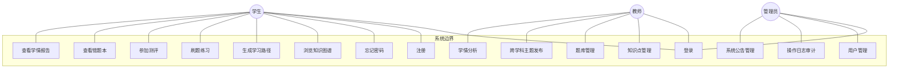
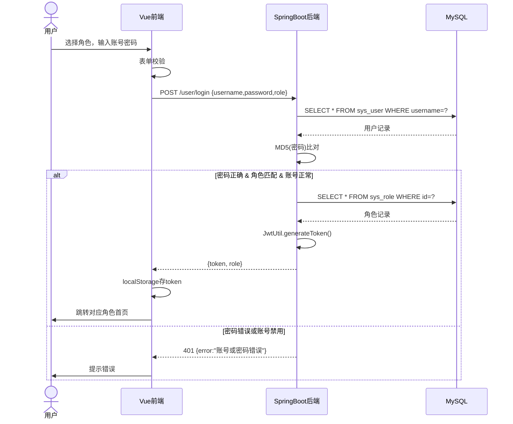
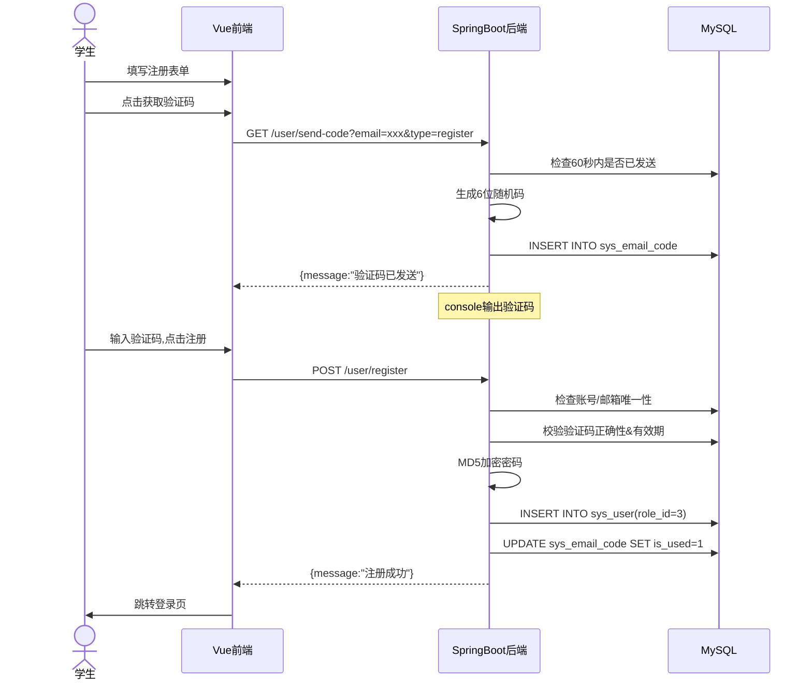
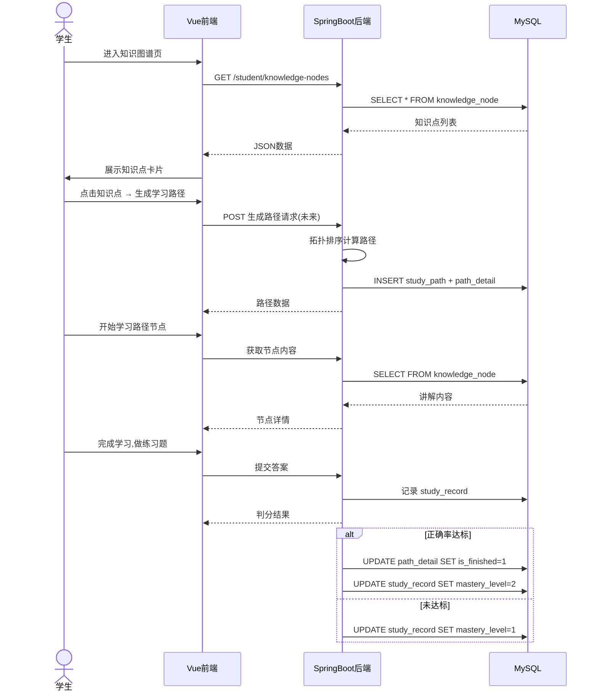
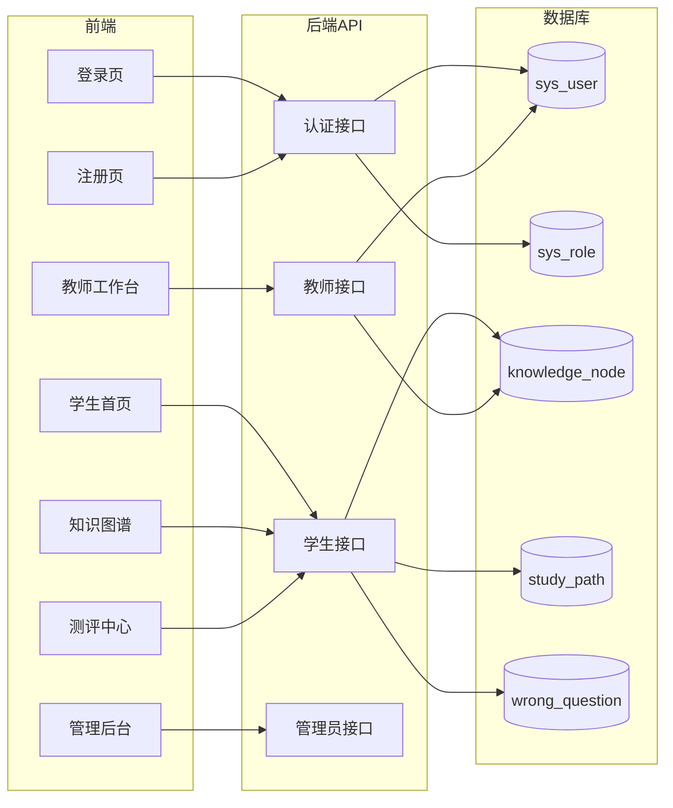
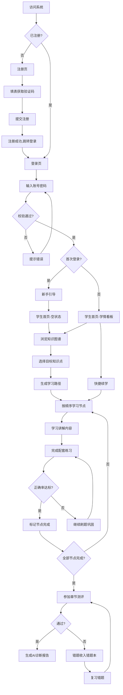
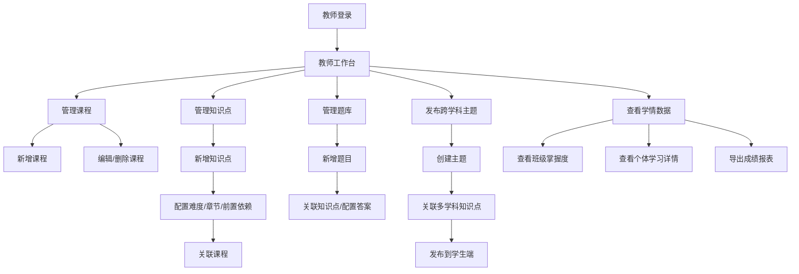

# KG 智能导学系统 — UML 图

## 1. 用例图

```mermaid
graph TB
    subgraph 系统边界
        A[登录]
        B[注册]
        C[忘记密码]
        D[浏览知识图谱]
        E[生成学习路径]
        F[刷题练习]
        G[参加测评]
        H[查看错题本]
        I[查看学情报告]
        J[知识点管理]
        K[题库管理]
        L[跨学科主题发布]
        M[学情分析]
        N[用户管理]
        O[操作日志审计]
        P[系统公告管理]
    end

    Student((学生))
    Teacher((教师))
    Admin((管理员))

    Admin --- A
    Admin --- N
    Admin --- O
    Admin --- P

    Student --- A
    Student --- B
    Student --- C
    Student --- D
    Student --- E
    Student --- F
    Student --- G
    Student --- H
    Student --- I

    Teacher --- A
    Teacher --- J
    Teacher --- K
    Teacher --- L
    Teacher --- M
```

## 2. 顺序图 — 登录

```mermaid
sequenceDiagram
    actor U as 用户
    participant F as Vue前端
    participant B as SpringBoot后端
    participant D as MySQL

    U->>F: 选择角色，输入账号密码
    F->>F: 表单校验
    F->>B: POST /user/login {username,password,role}
    B->>D: SELECT * FROM sys_user WHERE username=?
    D-->>B: 用户记录
    B->>B: MD5(密码)比对
    alt 密码正确 & 角色匹配 & 账号正常
        B->>D: SELECT * FROM sys_role WHERE id=?
        D-->>B: 角色记录
        B->>B: JwtUtil.generateToken()
        B-->>F: {token, role}
        F->>F: localStorage存token
        F->>U: 跳转对应角色首页
    else 密码错误或账号禁用
        B-->>F: 401 {error:"账号或密码错误"}
        F->>U: 提示错误
    end
```

## 3. 顺序图 — 注册

```mermaid
sequenceDiagram
    actor S as 学生
    participant F as Vue前端
    participant B as SpringBoot后端
    participant D as MySQL

    S->>F: 填写注册表单
    S->>F: 点击获取验证码
    F->>B: GET /user/send-code?email=xxx&type=register
    B->>D: 检查60秒内是否已发送
    B->>B: 生成6位随机码
    B->>D: INSERT INTO sys_email_code
    B-->>F: {message:"验证码已发送"}
    Note over B: console输出验证码

    S->>F: 输入验证码,点击注册
    F->>B: POST /user/register
    B->>D: 检查账号/邮箱唯一性
    B->>D: 校验验证码正确性&有效期
    B->>B: MD5加密密码
    B->>D: INSERT INTO sys_user(role_id=3)
    B->>D: UPDATE sys_email_code SET is_used=1
    B-->>F: {message:"注册成功"}
    F->>S: 跳转登录页
```

## 4. 顺序图 — 学习流程

```mermaid
sequenceDiagram
    actor S as 学生
    participant F as Vue前端
    participant B as SpringBoot后端
    participant D as MySQL

    S->>F: 进入知识图谱页
    F->>B: GET /student/knowledge-nodes
    B->>D: SELECT * FROM knowledge_node
    D-->>B: 知识点列表
    B-->>F: JSON数据
    F->>S: 展示知识点卡片

    S->>F: 点击知识点 → 生成学习路径
    F->>B: POST 生成路径请求(未来)
    B->>B: 拓扑排序计算路径
    B->>D: INSERT study_path + path_detail
    B-->>F: 路径数据

    S->>F: 开始学习路径节点
    F->>B: 获取节点内容
    B->>D: SELECT FROM knowledge_node
    D-->>B: 讲解内容
    B-->>F: 节点详情

    S->>F: 完成学习,做练习题
    F->>B: 提交答案
    B->>D: 记录 study_record
    B-->>F: 判分结果

    alt 正确率达标
        B->>D: UPDATE path_detail SET is_finished=1
        B->>D: UPDATE study_record SET mastery_level=2
    else 未达标
        B->>D: UPDATE study_record SET mastery_level=1
    end
```

## 5. 协作图（通信图）— 系统模块交互

```mermaid
graph LR
    subgraph 前端
        Login[登录页]
        Register[注册页]
        StuHome[学生首页]
        KGGraph[知识图谱]
        ExamC[测评中心]
        TeachWP[教师工作台]
        AdminP[管理后台]
    end

    subgraph 后端API
        AuthAPI[认证接口]
        StuAPI[学生接口]
        TeachAPI[教师接口]
        AdminAPI[管理员接口]
    end

    subgraph 数据库
        UserT[(sys_user)]
        RoleT[(sys_role)]
        NodeT[(knowledge_node)]
        PathT[(study_path)]
        WrongT[(wrong_question)]
    end

    Login --> AuthAPI
    Register --> AuthAPI
    AuthAPI --> UserT
    AuthAPI --> RoleT

    StuHome --> StuAPI
    KGGraph --> StuAPI
    ExamC --> StuAPI
    StuAPI --> NodeT
    StuAPI --> PathT
    StuAPI --> WrongT

    TeachWP --> TeachAPI
    TeachAPI --> NodeT
    TeachAPI --> UserT

    AdminP --> AdminAPI
```

## 6. 流程图 — 学生完整学习流程

```mermaid
flowchart TD
    A[访问系统] --> B{已注册?}
    B -->|否| C[注册页]
    C --> D[填表获取验证码]
    D --> E[提交注册]
    E --> F[注册成功,跳转登录]
    F --> G[登录页]
    B -->|是| G

    G --> H[输入账号密码]
    H --> I{校验通过?}
    I -->|否| J[提示错误]
    J --> H
    I -->|是| K{首次登录?}
    K -->|是| L[新手引导]
    L --> M[学生首页-空状态]
    K -->|否| N[学生首页-学情看板]

    M --> O[浏览知识图谱]
    N --> O
    N --> P[快捷续学]

    O --> Q[选择目标知识点]
    Q --> R[生成学习路径]
    R --> S[按顺序学习节点]

    P --> S
    S --> T[学习讲解内容]
    T --> U[完成配套练习]
    U --> V{正确率达标?}
    V -->|是| W[标记节点完成]
    V -->|否| X[继续刷题巩固]
    X --> U
    W --> Y{全部节点完成?}
    Y -->|否| S
    Y -->|是| Z[参加章节测评]
    Z --> AA{通过?}
    AA -->|是| AB[生成AI诊断报告]
    AA -->|否| AC[错题收入错题本]
    AC --> AD[复习错题]
    AD --> Z
```

## 7. 流程图 — 教师工作流程

```mermaid
flowchart TD
    A[教师登录] --> B[教师工作台]
    B --> C[查看学情数据]
    B --> D[管理课程]
    B --> E[管理知识点]
    B --> F[管理题库]
    B --> G[发布跨学科主题]

    D --> D1[新增课程]
    D --> D2[编辑/删除课程]

    E --> E1[新增知识点]
    E1 --> E2[配置难度/章节/前置依赖]
    E2 --> E3[关联课程]

    F --> F1[新增题目]
    F1 --> F2[关联知识点/配置答案]

    G --> G1[创建主题]
    G1 --> G2[关联多学科知识点]
    G2 --> G3[发布到学生端]

    C --> C1[查看班级掌握度]
    C --> C2[查看个体学习详情]
    C --> C3[导出成绩报表]
```

