# KG 智能导学系统 — UML 图（标准记法）

> 所有图均采用 **PlantUML** 绘制，遵循 UML 2.x 标准记法。
> 源文件位于 `docs/diagrams/` 目录，可用 VS Code + PlantUML 插件直接编辑预览，
> 或运行 `plantuml -tpng *.puml` 批量重新渲染。

---

## 1. 用例图 (Use Case Diagram)

**标准 UML 三要素**：系统边界（矩形） + 参与者/Actor（火柴人） + 用例（椭圆）

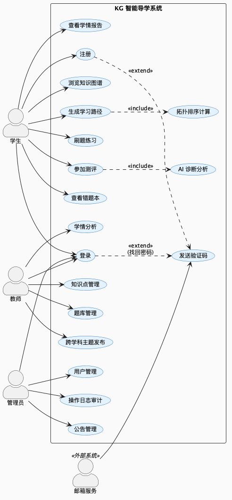

📄 PlantUML 源文件 (01_usecase.puml)

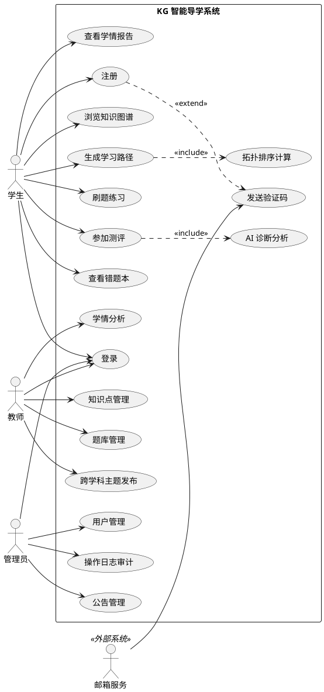

---

## 2. 顺序图 — 登录 (Sequence Diagram)

**标准 UML**：带生命线的 Actor/Participant、激活框、alt/else 组合片段

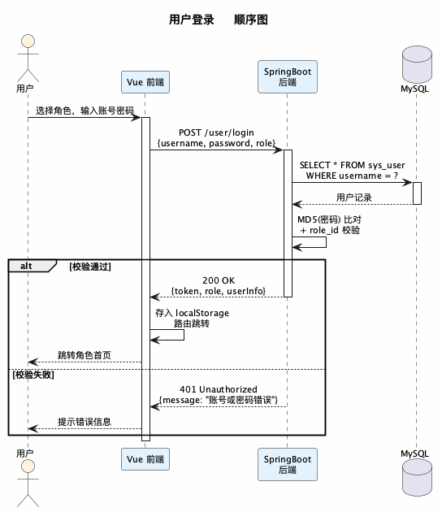

📄 PlantUML 源文件 (02_seq_login.puml)

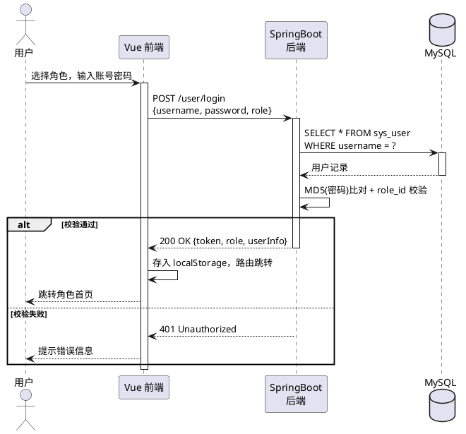

---

## 3. 顺序图 — 注册 (Sequence Diagram)

**标准 UML**：分段 (`== ==`)、Note 注释、生命线

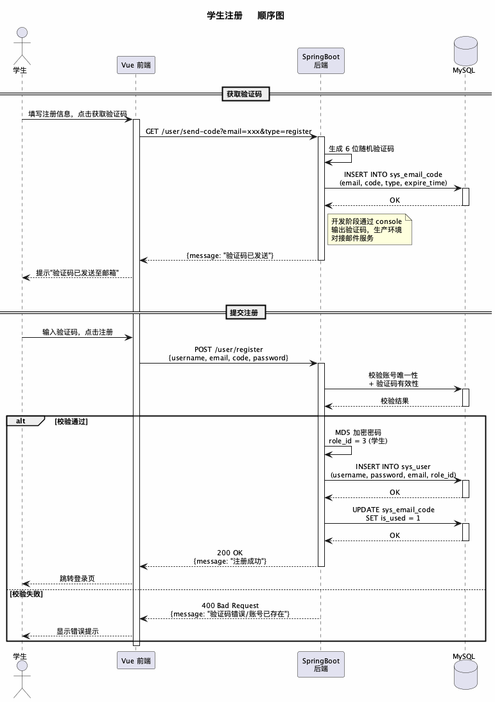

📄 PlantUML 源文件 (03_seq_register.puml)

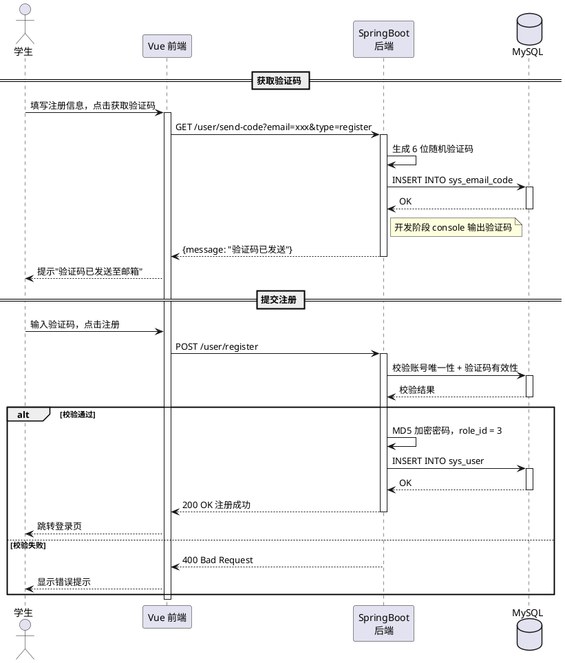

---

## 4. 顺序图 — 学习流程 (Sequence Diagram)

**标准 UML**：分段、loop 循环片段、内嵌 alt 片段、自调用

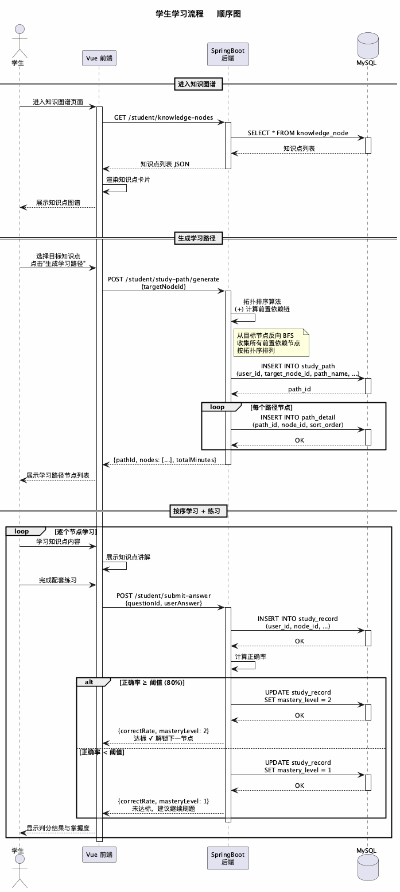

📄 PlantUML 源文件 (04_seq_study.puml)

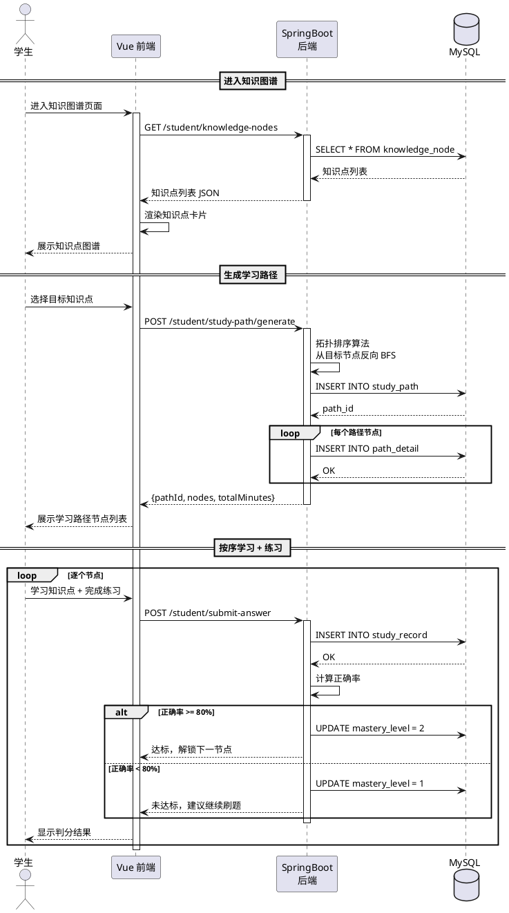

---

## 5. 通信图/协作图 (Communication Diagram)

**标准 UML**：对象矩形（`:ClassName`） + 链路（link） + 编号消息序列（`1:`, `2:`, `2.1:` 等嵌套编号）

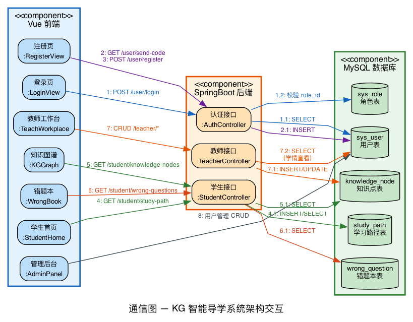

> 此图使用 Graphviz DOT 绘制（PlantUML 不原生支持通信图）。
> 渲染命令：`dot -Tpng 05_communication.dot -o 05_communication.png`

📄 DOT 源文件 (05_communication.dot)

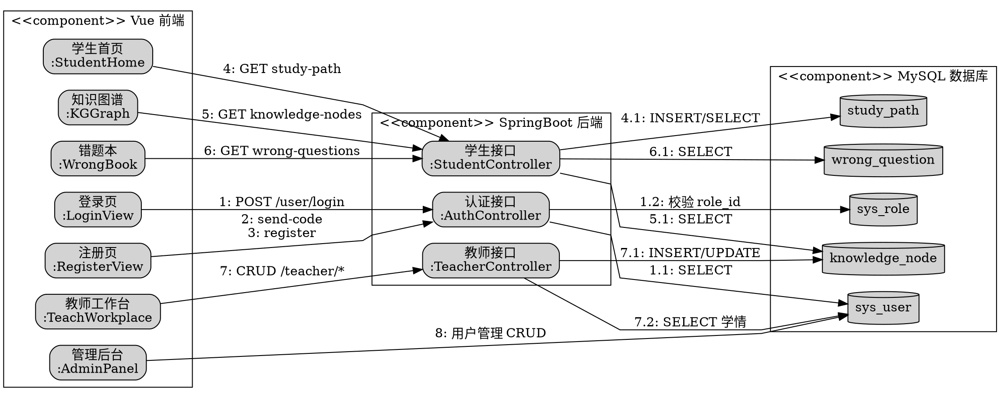

---

## 6. 活动图 — 学生完整学习流程 (Activity Diagram)

**标准 UML**：起始/终止节点、活动（圆角矩形）、菱形判断、while 循环

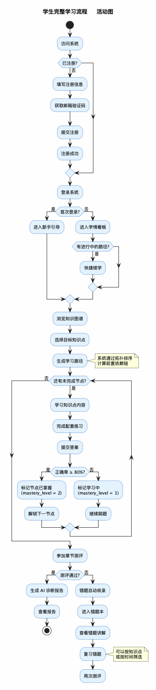

📄 PlantUML 源文件 (06_activity_student.puml)

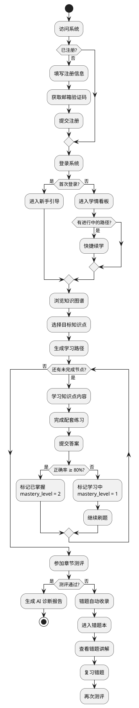

---

## 7. 活动图 — 教师工作流程 (Activity Diagram)

**标准 UML**：泳道分区、活动、判断

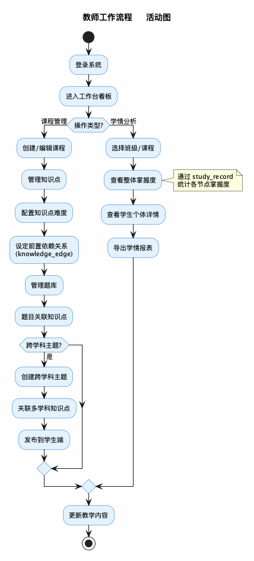

📄 PlantUML 源文件 (07_activity_teacher.puml)

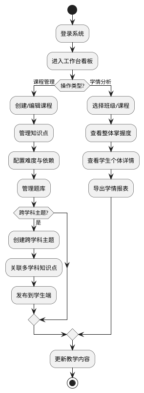

---

## 8. 活动图 — 注册与验证码流程 (Activity Diagram)

**标准 UML**：泳道分区、多级判断、超时处理

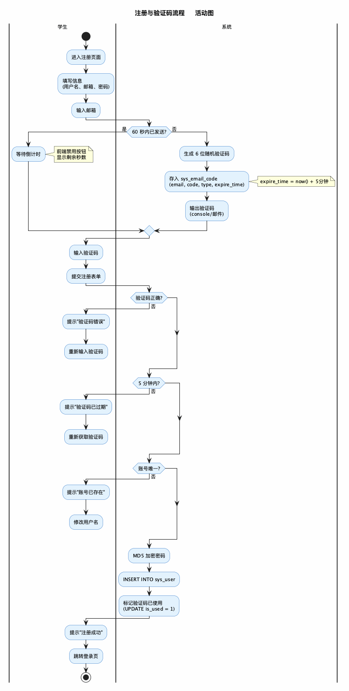

📄 PlantUML 源文件 (08_activity_register.puml)

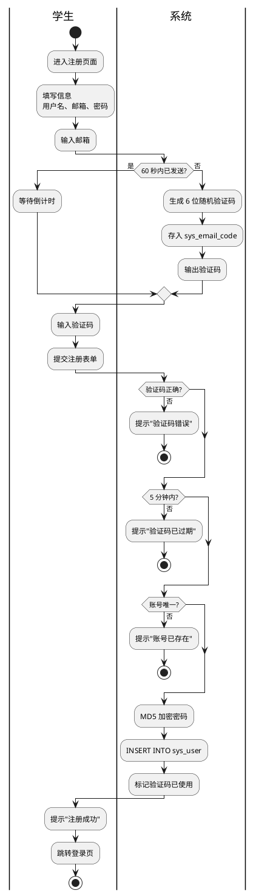

---

## 记法对照说明

| 旧版问题 | 新版改进 |
|---|---|
| 用例图用 `graph LR` 拼凑，无系统边界、无椭圆用例 | 标准 UML：矩形边界 + Actor + 椭圆用例 + `<<extend>>`/`<<include>>` |
| 协作图用 flowchart 代替，只有箭头无消息编号 | 标准 UML 通信图：对象矩形 + 链路 + `1:`, `2:`, `1.1:` 嵌套消息编号 |
| 流程图用 `flowchart LR`，无起始/终止节点 | 标准 UML 活动图：实心起止点 + 圆角活动 + 菱形判断 + 泳道 |
| 顺序图缺少激活框和分段 | 补充 `activate/deactivate`、`== 分段 ==`、`note` 注释 |
