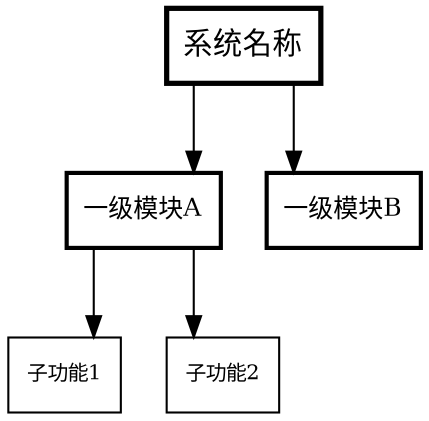

# 功能树形图绘图标准

## 工具

**Graphviz DOT**，`rankdir=TB`，`splines=ortho`。

## 规范

1. **根节点**：顶部居中矩形框，加粗边框（penwidth=2.5），字号 14
2. **一级模块**：penwidth=2，字号 12
3. **二级及以下**：penwidth=1，字号 10 → 9
4. **同层对齐**：`{ rank=same; ... }` 强制水平对齐
5. **节点**：`shape=box`，白底黑框，黑字
6. **字体**：Times-Roman
7. **连线**：黑色正交直线，penwidth=1
8. **层间距**：`ranksep=0.6`

## 模板



## 渲染

```bash
dot -Tpng input.dot -o output.png
```

## 示例

`docs/diagrams/functional_tree.dot`
