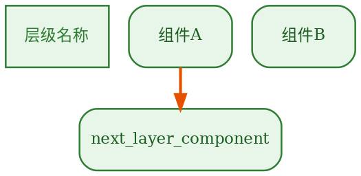

# 技术架构图绘图标准

## 工具

**Graphviz DOT**，`rankdir=TB`，`splines=ortho`。

## 布局

垂直分层（从上到下），**每层用 `subgraph cluster` 大框包裹**。

- 左侧：彩色标签节点（`shape=box, style=filled,bold`），统一宽度 1.3，统一高度 1.0
- 右侧：技术组件节点（`shape=box, style=rounded,filled`），节点内底色比大框略浅一档
- 大框 `label=""` 不显示标题，标签信息由左侧节点承载
- `{ rank=same; 标签; 组件... }` 强制同层对齐
- 隐藏线 `L1 -> L2 -> L3 [style=invis]` 让标签列垂直对齐

```dot
subgraph cluster_L1 {
    style="rounded,filled"; fillcolor="#E8F5E9"; color="#2E7D32"; penwidth=2.5; label="";
    node [fillcolor="#C8E6C9", color="#2E7D32", ...];
    { rank=same; L1 [label="访问层"]; a1 [label="PC浏览器"]; a2 [label="手机浏览器"]; }
}
```

## 颜色编码

| 层级 | 节点底色 | 边框色 | 文字色 | 含义 |
|---|---|---|---|---|
| 访问层 | `#E8F5E9` | `#2E7D32` | `#1B5E20` | 绿色 |
| 前端框架 | `#FCE4EC` | `#C62828` | `#880E4F` | 紫红 |
| 模块 | `#E3F2FD` | `#1565C0` | `#0D47A1` | 蓝色 |
| 业务 | `#EDE7F6` | `#4527A0` | `#311B92` | 紫色 |
| 中间件/服务 | `#FFF3E0` | `#E65100` | `#BF360C` | 橙色 |
| 数据库 | `#FFEBEE` | `#B71C1C` | `#B71C1C` | 红色 |

## 节点规范

1. 左侧标签：竖条矩形，`shape=box`，`style="filled,bold"`，宽度 1.0
2. 右侧组件：`shape=box`，`style="rounded,filled"`，圆角矩形
3. 外部服务：`style="rounded,filled,dashed"` 虚线边框
4. 同层对齐：`{ rank=same; 左侧标签; 右侧组件... }`

## 连线规范

1. 层内水平线：`style=invis`（隐藏线，仅对齐用）
2. 跨层关联线：对应层级的主题色，penwidth=2
3. 外部 API 调用：`style=dashed`，灰色

## 模板



## 渲染

```bash
dot -Tpng input.dot -o output.png
```

## 示例

`docs/diagrams/tech_architecture.dot`
